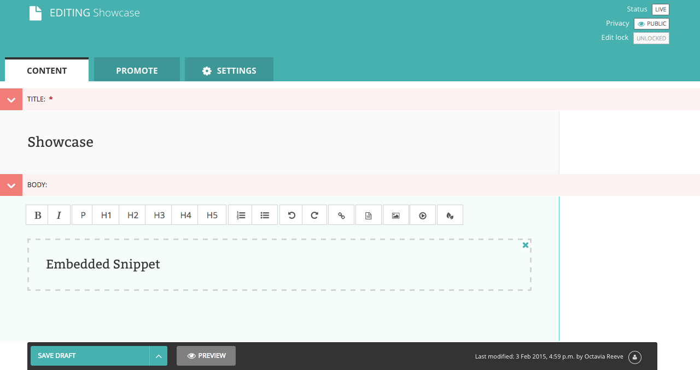

# wagtailembedder [](https://pypi.python.org/pypi/wagtailembedder)

> Snippets embedder for Wagtail RichTextField.

*Check out [Awesome Wagtail](https://github.com/springload/awesome-wagtail) for more awesome packages and resources from the Wagtail community.*



## Quickstart

Install the package with

```sh
pip install wagtailembedder
```

Add `wagtailembedder` to your `settings.py` in the `INSTALLED_APPS` section:

```python
INSTALLED_APPS = [
    ...
    'modelcluster',
    'wagtailembedder',
    'core',
    ...
]
```

For each models registered as a wagtail.snippets create an html file to render the template inside a RichText field.

 * Templates names will match snippets models names replacing capital letters with underscores, Wagtail style.
   For the ```SocialMediaLink``` snippet in the ```core``` app, it will look for the following template ```core/templates/snippets/socialmedialink.html```.
 * The variable containing the snippet instance in the template is ```snippet```.

If no template is defined then an exception will be raised in the frontend when rendering a RichTextField with the embedded snippet in it. Make sure you write some templates for your snippets before start to embedding them.

# Options

If the snippet meta has a description field, it will show up next to the snippet name in the admin interface.

```python
from django.db import models
import django.db.models.options as options

options.DEFAULT_NAMES = options.DEFAULT_NAMES + ('description',)


@register_snippet
class MySnippet(models.Model):
    # fields definition

    class Meta:
        description = "My Snippet Description"
```

## Development

### Releases

- Make a new branch for the release of the new version.
- Update the [CHANGELOG](https://github.com/springload/wagtailembedder/CHANGELOG.md).
- Update the version number in `setup.py`, following semver.
- Make a PR and squash merge it.
- Back on master with the PR merged, use `make publish` (confirm, and enter your password).
- Finally, go to GitHub and create a release and a tag for the new version.
- Done!
